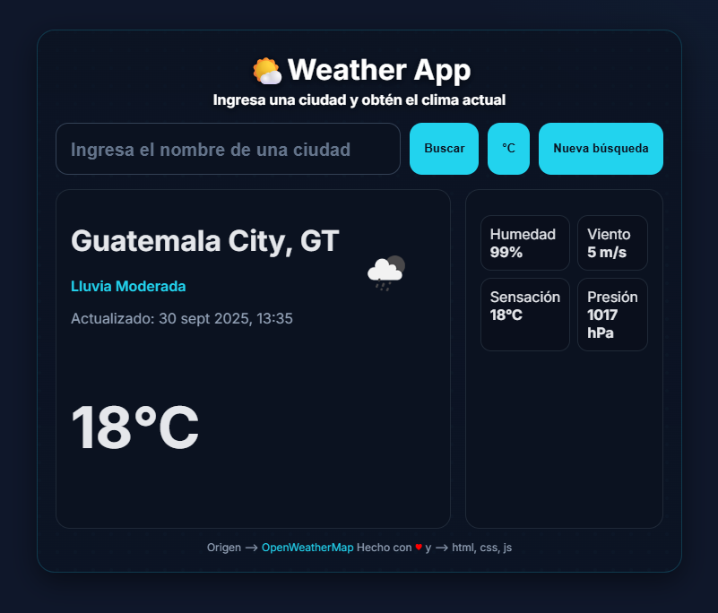

# Weather App

Este proyecto es una aplicación web de clima que permite consultar el estado del tiempo de cualquier ciudad ingresada por el usuario. Utiliza una interfaz moderna y responsiva, mostrando información relevante como temperatura, condiciones climáticas, detalles adicionales y la hora de la última actualización.

  

## Funcionalidad

- **Búsqueda de ciudad:** El usuario puede ingresar el nombre de una ciudad para consultar el clima actual.
- **Visualización de datos:** Se muestra la temperatura, el estado del clima (soleado, nublado, etc.), un ícono representativo, y detalles adicionales como humedad, viento, etc.
- **Actualización en tiempo real:** La información se actualiza cada vez que se realiza una nueva búsqueda.
- **Diseño responsivo:** La interfaz se adapta a diferentes tamaños de pantalla, ofreciendo una experiencia óptima en computadoras y dispositivos móviles.
- **Mensajes de estado:** Se informa al usuario si hay errores (por ejemplo, ciudad no encontrada) o si la información está cargando.

## Estructura del Proyecto

- `app.js`: Lógica principal de la aplicación, manejo de eventos, consumo de API y actualización del DOM.
- `card_weather_app.html`: Archivo HTML principal que contiene la estructura de la interfaz de usuario.
- `estilo.css`: Hojas de estilo para el diseño visual y responsivo de la aplicación.

## Tecnologías Utilizadas

- **HTML5:** Estructura básica de la aplicación.
- **CSS3:** Estilos modernos, variables CSS, diseño responsivo y efectos visuales.
- **JavaScript (ES6+):** Lógica de la aplicación, manejo de eventos y consumo de APIs.
- **API de clima:** Se utiliza una API pública para obtener los datos meteorológicos en tiempo real del sitio web openweathermap.org, lee la documentación para ver las limitaciones de la capa gratuita.

## Cómo usar

1. Clona o descarga este repositorio.
2. Abre el archivo `card_weather_app.html` en tu navegador web.
3. Ingresa el nombre de una ciudad en el buscador y presiona el botón para consultar el clima.

## Créditos

Desarrollado por José Miguel Tojil Gento.

---

¡Siéntete libre de modificar y mejorar este proyecto!